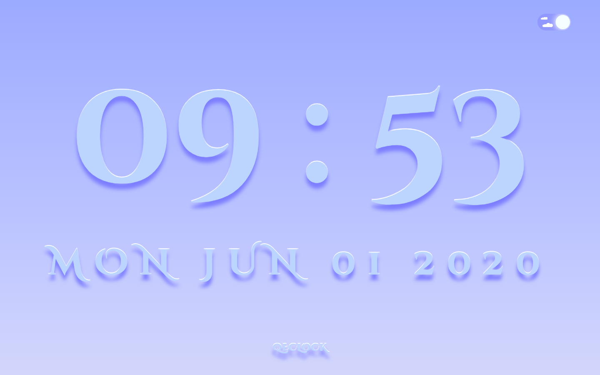
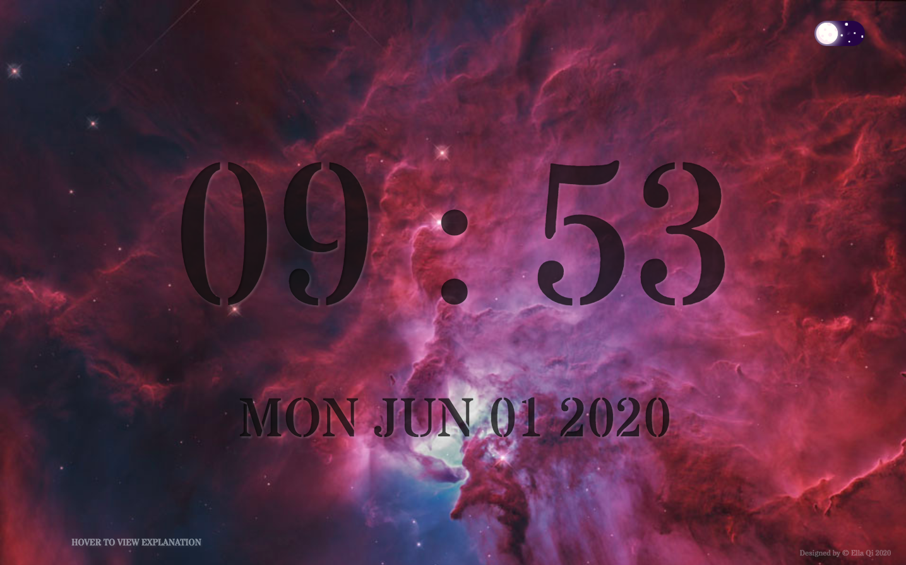
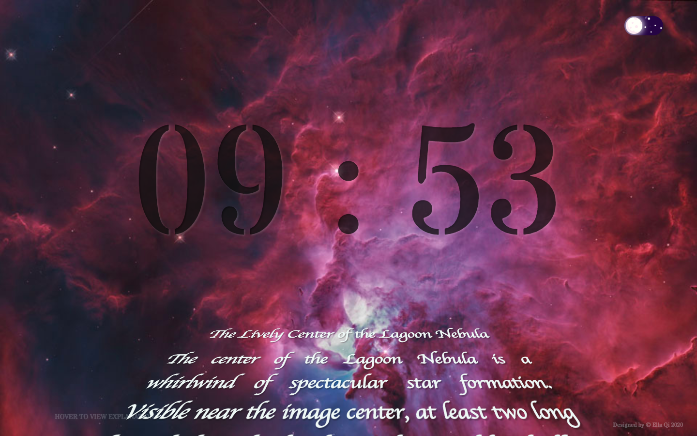

Q.E.Clock  :clock3:
======================
A simple clock with date :date:  helps to focus on work and study :bulb:  two modes switchable: **Clean mode & Space mode**  
Click the fancy toggle button on the top right corner to switch mode. Smooth transition between switching of two modes.  

Built with
-----------
  * Vue
  * HTML5
  * CSS3
  * no framework

Space mode :stars:
----------
1. background picture from Nasa daily featured :telescope: &nbsp; changes every day 
2. Star War 3D title effect for the daily featured picture explanation, when mouse hover on the "HOVER TO VIEW EXPLANATION" 
3. fade in & fade out transition for the explanation text
4. date disappears when explanation shows, increase the readability
5. replace the bg picture by default HD pictures when:
   * the daily featured picture from NASA is not a standard jpg/png/jpeg format (could be a video, it happened before, odd)
   * the brightness of daily featured picture from NASA is too low or too high  

Clean mode :eye:
------------
just clean style with the ingredient colour background

Screenshots
-----------

June 1st's space mode looks like:

with explanation:

